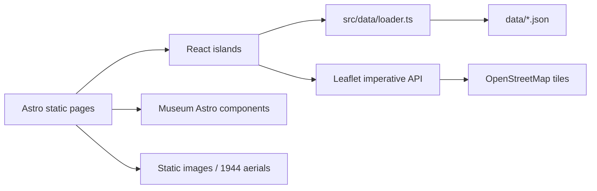
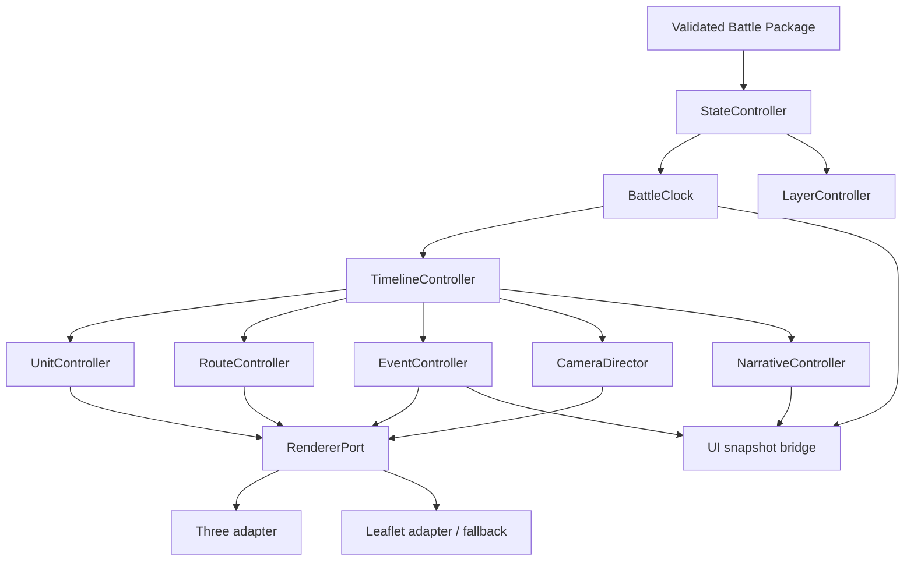
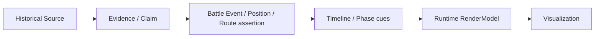

# Battlefield_OS — Historical Battle Replay Engine

## Architecture Audit & Implementation Plan

- 審查日期：2026-08-12
- 審查範圍：`D:\Hermes\Projects\1949`
- 審查性質：架構探索、缺口分析與實作規劃
- 本文件狀態：規劃基準，尚未授權實作 Battle Replay
- 本次變更：只新增本文件；未修改 production code、未建立動畫、未新增或改寫史料與座標

> 結論先行：目前 repository 是一個以 Astro 靜態輸出、React islands 與 Leaflet 組成的數位戰爭博物館，不是可重用的 Historical Battle Replay Engine。資料層已具有可觀的事件、時間線、地點、人物、來源、敘事、不確定性與空間關聯素材，但尚缺資料契約、可決定性時鐘、單位／路線 runtime、3D renderer、攝影機導演、事件總線與效能架構。建議「有條件 Go」：可以進入 BR-0 與 BR-1；在座標、路線時間與單位資料通過史料驗證前，不應進入對外發布的部隊移動動畫。

---

## 1. Current State

### 1.1 Repository 現況

目前主要結構如下：

```text
1949/
├─ .github/workflows/deploy.yml
├─ data/                         # 22 份 JSON，現行歷史資料來源
│  ├─ events.json
│  ├─ timeline.json
│  ├─ poi.json
│  ├─ persons.json
│  ├─ sources.json
│  ├─ unit_index.json
│  ├─ route_database.json
│  ├─ terrain_database.json
│  ├─ spatial_network.json
│  ├─ interactive_timeline.json
│  ├─ scenes.json
│  ├─ narrative_beats.json
│  ├─ narratives.json
│  ├─ uncertainty_labels.json
│  └─ prc/
├─ docs/
│  └─ COORDINATE_REVIEW.md       # 25 個 POI 與 4 組路線均待人工校對
├─ public/
│  ├─ aerial-1944.png            # 2,526,468 bytes
│  └─ aerial-1944a.png           # 5,384,381 bytes
├─ scripts/
│  └─ kinmen_1944.xml            # 中研院 Kinmen_1944 WMTS/GDAL 描述
├─ src/
│  ├─ components/
│  │  ├─ hero/HeroMap.tsx
│  │  ├─ map/{BattleMap,LocationExplorer,MiniMap}.tsx
│  │  └─ timeline/BattleTimeline.tsx
│  ├─ data/{loader,types,perspectiveLoader}.ts
│  ├─ pages/[lang]/
│  ├─ store/{lang,perspective}.ts
│  └─ styles/global.css
├─ astro.config.mjs
├─ package.json
└─ tsconfig.json
```

Repository 中沒有 `database/`、`terrain/` 或 `maps/` 目錄；也沒有可執行的 Three.js、CesiumJS 或 WebGL 場景程式。`ARCHITECTURE.md` 與 Battlefield OS 頁面提到 Three.js、CesiumJS、`react-globe.gl`、GSAP 等技術方向，但這些套件不在目前的 dependency tree，應視為規劃概念，不是現有能力。

### 1.2 現行執行架構



- Astro 7.1.6 負責靜態頁面與多語路由。
- React 19.2.8 僅用於搜尋、首頁航照、時間線與 Leaflet 地圖等 islands。
- TypeScript 6.0.3 採 Astro strict preset。
- 地圖實作直接使用 Leaflet 1.9.4 imperative API；雖安裝 `react-leaflet`，本次審查的地圖元件並未使用它。
- nanostores 只有語言與 perspective 兩個 atom；perspective store 沒有被畫面消費。
- 沒有 engine loop、scene graph abstraction、battle clock、playback state machine 或 renderer adapter。

### 1.3 資料規模

目前 22 份 JSON 合計約 771,606 bytes：

| 資料 | 筆數 | 現況用途 |
|---|---:|---|
| timeline | 123 | 已用於四日閱讀型時間線 |
| events | 30 | 已用於戰役解析與卡片 |
| POI | 25 | 已用於 Leaflet 地圖與地點頁 |
| persons | 36 | 已用於人物頁 |
| sources | 38 | 已用於來源頁與證據卡 |
| units | 25 | 已載入，但沒有 replay runtime |
| story arcs | 12 | 已用於故事列表 |
| scenes | 33 | 部分用於故事頁，未成為 runtime scene |
| narrative beats | 115 | 有結構，尚未驅動回放 |
| narratives | 47 | 已載入，未驅動回放 |
| interactive timeline segments | 12 | 已載入，未驅動回放 |
| audio guides | 25 | 已載入，未驅動回放 |
| spatial nodes / connections | 25 / 36 | 已載入，未驅動地理 runtime |
| perspective events | 5 | 已用於多元史觀頁 |
| PRC timeline / personnel | 13 / 7 | 已載入，但 loader 依賴 fallback 猜測陣列欄位 |

### 1.4 Build 與部署

- `output: 'static'`、`trailingSlash: 'always'`。
- GitHub Pages base path：`/1949-guningtou`。
- GitHub Actions 使用 Node 22、`npm ci`、`npm run build`、Pages artifact 與 `actions/deploy-pages`。
- 無 server runtime、無 API、無資料庫連線、無持久化後端。
- 地圖底圖執行時依賴外部 OpenStreetMap tile service。
- 多處仍硬編碼 `/1949-guningtou`；Battle Replay 必須改由單一 asset/base-path port 取得路徑，否則 preview、custom domain 與未來部署環境容易失效。

### 1.5 測試現況

- `package.json` 沒有 `test` script。
- Repository 沒有 unit、integration、E2E、visual regression 或 performance test。
- 有 `astro check`，但它只提供型別／Astro 診斷，不會驗證歷史資料參照完整性或回放決定性。

---

## 2. Existing Capabilities

### 2.1 可直接重用

| 能力 | 現況 | 重用方式 |
|---|---|---|
| Astro 多語靜態外殼 | Existing / Reusable | 保留為網站 shell 與內容頁；Replay 作為獨立 React island 或 route bundle |
| Museum design tokens | Existing / Reusable | Replay UI 使用既有顏色、字體、證據 badge、panel 與 responsive 原則 |
| POI 與地點頁 | Existing / Needs Refactor | 轉為 `Location` adapter；原頁面保留 |
| 來源與證據卡 | Existing / Reusable | Source Viewer 可重用語彙與 citation 呈現，資料契約需加強 |
| 四日時間線閱讀介面 | Existing / Needs Refactor | 保留內容瀏覽；不要把它當 BattleClock |
| 多元史觀頁 | Existing / Needs Refactor | 轉為 claim/perspective layer；保留衝突，不合併成單一真相 |
| 故事、場景與 narrative beat | Existing / Needs Refactor | 可作 NarrativeController 輸入，但不可直接當歷史事件真值 |
| Leaflet 2D map | Existing / Reusable | 作為 fallback、minimap、debug view 與 mobile low-quality mode |
| 1944 航照影像 | Existing / High Risk | 可作歷史影像 overlay 候選；必須先確認地理配準、授權與尺寸策略 |
| Static GitHub Pages pipeline | Existing / Reusable | Engine 與 battle package 必須能完全靜態部署 |

### 2.2 已存在但未接線的資料能力

- `interactive_timeline.json` 已有時間區段、事件、POI、route、camera focus 與 narration cue 的雛形。
- `scenes.json` 已有時間、地點、單位、事件、camera recommendation、uncertain elements 與 prohibited reconstruction elements。
- `narrative_beats.json` 已有 interaction trigger、source、evidence、uncertainty 與 duration。
- `uncertainty_labels.json` 已有近似時間、近似位置、爭議、單一來源、後來回憶與戲劇重建等分類。
- `spatial_network.json` 有拓撲節點、連線、距離與戰時移動時間。
- `terrain_database.json` 有 POI 層級的地形描述與估計高度，但不是 DEM、heightmap 或 terrain tiles。

這些資料能降低 domain discovery 成本，但目前都不是可直接渲染的 replay package。

---

## 3. Architecture Gaps

### 3.1 Gap matrix

| 項目 | 狀態 | 判定 |
|---|---|---|
| Reusable battle engine | Missing | 沒有 engine API、lifecycle、ports 或 battle package contract |
| Timeline engine | Needs Refactor | 只有日期篩選與展開，沒有連續時間、事件 crossing、seek 或 determinism |
| BattleClock | Missing | 沒有 single source of truth |
| Playback controller | Missing | 沒有 play、pause、scrub、speed、jump state machine |
| Unit data model | Needs Refactor | 25 個 unit 只有名稱、side、parent、type 與關聯；缺 strength、position、status、commander runtime refs |
| Formation hierarchy | Partial | parent unit 可作起點，沒有明確 Formation entity 與 hierarchy validation |
| Route model | High Risk / Needs Refactor | route database 只有 from/to POI 與距離；沒有 route ID、geometry、timestamp 或 GeoJSON |
| Route animation | Missing | 地圖上的 4 組路線是 React 元件內硬編碼 polyline |
| Hard-coded map routes | Deprecated for Replay | 只保留現行 2D 頁面相容性；不得成為新 engine 的資料來源 |
| GeoJSON support | Missing | 沒有 parser、schema 或 feature properties contract |
| Cesium / Three strategy | Missing | 文件提及，程式與依賴不存在 |
| Coordinate transformation | Missing | 只有 WGS84 lat/lng 顯示，沒有 ENU/local origin、altitude datum 或 precision policy |
| Camera controller/director | Missing | Leaflet 只有固定 center 與 `flyTo`；無 replay camera state |
| Event system | Partial Data Only | 有 event JSON，沒有 runtime event bus、enter/exit semantics 或 seek replay policy |
| Narrative UI | Partial | 有故事頁，沒有由 BattleClock 驅動的 Narrative Panel |
| Source citation model | Partial / Reusable | 來源卡可重用；事件、claim、頁碼、evidence 關聯仍不完整 |
| Perspective model | Partial / Needs Refactor | 5 個事件含 ROC/PLA/civilian；neutral/editorial 與 unknown/disputed 尚未成為 claim 層 |
| Uncertainty model | Partial / Needs Refactor | 有 labels/evidence/confidence，但 enum、語意、視覺與資料欄位不一致 |
| Layer controller | Missing | 沒有地形、單位、路線、事件、標籤、來源 overlay 的統一開關 |
| Save/share state | Missing | 沒有 URL-serializable replay state |
| LOD / instancing | Missing | 沒有 3D runtime |
| Asset streaming | Missing | JSON 靜態 import、圖片直接載入 |
| Mobile replay | Missing | 網站 responsive 已存在，但未定義 3D quality tiers、touch controls 或 fallback |
| Multilingual replay | Partial | 三語 route 存在，但 replay content 與 domain localized text contract 尚未建立 |
| Tests and data validation | Missing | 無 schema validation、reference integrity、clock 或 renderer tests |
| `react-globe.gl` / GSAP proposal | Deprecated as baseline | 僅存在舊架構文件，套件與 runtime 都不存在；新方案應重新以需求驗證 |

### 3.2 明確不應被誤認為現有能力的項目

- `ARCHITECTURE.md` 中的 `react-globe.gl`、Three.js 與 GSAP 是舊規劃，未落地。
- `/battlefield-os/` 頁面上的 Three.js / CesiumJS 是概念展示，不是 runtime。
- `terrain_database.json` 是地形語意 metadata，不是可載入的 terrain。
- `route_database.json` 是 POI 間拓撲關係，不是路線 geometry。
- `interactive_timeline.json` 是 cue data 雛形，不是 BattleClock。
- `currentPerspective` atom 目前沒有 consumer，不是完整 PerspectiveController。

### 3.3 資料契約不一致

- TypeScript `VerificationStatus` 只接受四個值，但 30 個 events 實際皆使用 `reviewed_v2`。
- Event evidence 分布為 A=1、C=20、E=9；timeline 為 A=14、C=104、E=5。現行 UI 顯示等級，但缺乏統一的 confidence semantics。
- POI 自稱 `Exact=8 / Approximate=8 / Estimated=9`，但 `docs/COORDINATE_REVIEW.md` 將 25 個 POI 全列為待驗證。這是阻止動畫上線的資料治理衝突。
- Event 的 `roc_units` / `pla_units` 是自由文字，而不是 `unit_id[]`。
- scenes 有 33 個 route references、interactive segments 有 12 個 route references，但 route database entry 沒有 `route_id`。
- loader 對 PRC timeline 請求 `records`，實際是 `entries`；對 PRC personnel 請求 `personnel`，實際是 `persons`。通用 fallback 讓錯誤未立即爆炸，卻掩蓋 schema drift。
- 多個 `related_*` 欄位同時存在 string、陣列或分隔字串，無法可靠做 referential integrity。

---

## 4. Dependency Analysis

### 4.1 現行依賴

| Dependency | Version | 角色 | Replay 影響 |
|---|---:|---|---|
| Astro | 7.1.6 | SSG / route shell | 保留；Replay 應 lazy island 化 |
| React / React DOM | 19.2.8 | 互動 islands | 保留 UI；不可承擔每幀 simulation state |
| TypeScript | 6.0.3 | strict typing | 保留；增加 runtime schema validation |
| Leaflet | 1.9.4 | 2D map | 保留作 fallback/minimap/debug |
| react-leaflet | 5.0.0 | 已安裝 | 現行 map 未使用；BR-0 決定移除或正式採用，避免雙 API |
| nanostores | 1.4.2 | 語言 atom | 可作 UI snapshot bridge；不要作 render loop |
| Tailwind / global CSS | 4.3.3 | Museum UI | 保留 |

### 4.2 尚未安裝的候選依賴

- Three.js：建議作首個 vertical slice 的單一 3D renderer。
- CesiumJS：延後到已證明需要 globe/streamed terrain 的 battle package；不要與 Three 同時成為首版主 renderer。
- Runtime schema：建議 Zod、Valibot 或 JSON Schema + Ajv，BR-1 只選一種。
- 測試：Vitest（domain/clock/adapters）與 Playwright（UI/E2E/visual）是候選；BR-0 決定版本與 scripts。
- GeoJSON utilities：只在需求出現時加入；先以標準 GeoJSON type 與小型自有 interpolation utility 控制 bundle。

### 4.3 Bundle 與 asset 現況

現有 `dist/_astro` 可見：

- `loader.*.js` 約 516,599 bytes。
- client runtime 約 184,017 bytes。
- Leaflet source chunk 約 148,798 bytes。
- 兩張航照分別約 2.5 MB 與 5.38 MB。

`src/data/loader.ts` 靜態匯入 22 份 JSON，任何 client island 一旦匯入 loader，容易把大量未使用資料帶入 client chunk。Replay 不可延續這個模式；battle manifest、核心事件、路線 geometry、來源內容與 media 必須分層 lazy load。

---

## 5. Risk Analysis

| 風險 | 等級 | 現況證據 | 緩解與停止條件 |
|---|---|---|---|
| 歷史座標不確定 | Critical | 25 POI 全待人工校對 | 未達 approved status 不發布精確移動；顯示估計／爭議樣式 |
| 路線 geometry 被虛構 | Critical | 現行 4 組 polyline 硬編碼；route DB 無 geometry | 只接受有來源與 uncertainty 的 GeoJSON；不從兩點自動畫出「史實路線」 |
| 估計時間被視為精確 | High | timeline 有 month/day/hour/早晚等混合 precision | 使用 time interval + precision；UI 不顯示假精確秒數 |
| 單位兵力未知 | High | unit model 無 strength；event 單位為自由文字 | strength 可為 range/unknown；不可用 marker 尺寸暗示未證實兵力 |
| 衝突來源被覆寫 | High | perspective 與 conflicting accounts 已存在 | 以 Claim/Perspective 並列，不生成單一 canonical assertion |
| 現代地形冒充 1949 | Critical | terrain DB 不是 DEM；OSM 與現代地形 | terrain layer 必須標示年代；歷史 coastline/terrain 未驗證時不得稱 1949 精準復原 |
| 1949 海岸線差異 | High | 現行航照未完成 georeference pipeline | 航照與 coastline 各自帶 temporal validity、source 與 registration error |
| Cesium/Three 同步 | High | 尚無策略 | 首版只啟用一個 renderer；用 port 保留替換能力，不做雙引擎 overlay |
| 浮點精度 | High | 尚無 local origin | WGS84 source + local ENU；GPU 使用相對座標，必要時 rebase |
| React 每幀更新 | High | 未有 clock | simulation/renderer imperative update；React 只接 5–10 Hz snapshot 或 selector change |
| Mobile GPU | High | 無 3D quality tiers | capability probe、LOD、低解析、效果關閉與 Leaflet fallback |
| 資料量與首次載入 | High | loader chunk >500 KB；航照大 | battle manifest + chunked assets + lazy source/media + compression |
| 外部圖磚可用性 | Medium | OSM runtime dependency | cache/fallback policy、合理 attribution、避免把 tile service 當保證 SLA |
| GitHub Pages 限制 | Medium | 純靜態、base path | 不依賴 server API；asset URL 全部由 base resolver；save/share 用 URL/local storage |
| 多語 schema 膨脹 | Medium | 三語 route、內容仍不一致 | `LocalizedText` 或 locale bundle；domain IDs 與文字分離 |
| 史料授權 | High | source 有 usage_rights，但 media 尚未形成一致 manifest | media 載入前驗證 rights、credit、download policy |
| Accessibility | High | 未有 replay controls | 鍵盤、reduced motion、文字替代時間線、色彩以外的不確定性 encoding |

### 5.1 發布前硬性閘門

1. 所有會移動的 Route 必須有來源、geometry status、時間 precision 與 reviewer。
2. 所有 Unit 必須能解析到 faction、parent formation 與至少一個事件／phase。
3. 每個 Event 必須能解析到 source 或明確標記 `unknown`，不可空白當作已證實。
4. 現代地形、1944 航照與推估 1949 coastline 必須在 UI 中分層標示。
5. Seek 前後結果必須 deterministic；不可因 FPS 不同觸發不同事件。

---

## 6. Battle Domain Model

### 6.1 原則

- Battle Data 與 Visualization Code 完全分離。
- ID、時間、座標與來源是 domain；顏色、材質、mesh 與動畫曲線是 visualization theme。
- 不確定性是所有 historical assertion 的一級欄位，不是 UI 裝飾。
- Perspective 保存「誰主張什麼」，而不是把多方說法壓成一個字串。
- 所有跨檔關聯使用 ID array，不使用分隔字串。

### 6.2 核心 entity

```text
Battle
├─ Phase[]
├─ Faction[]
│  └─ Formation[]
│     └─ Unit[]
├─ Commander[]
├─ Route[] (GeoJSON Feature)
├─ Event[]
├─ Location[] (GeoJSON Feature)
├─ Perspective[] / Claim[]
├─ Evidence[]
│  └─ Source[]
├─ Uncertainty[]
└─ Media[]
```

### 6.3 建議契約摘要

```ts
type EntityId = string;
type LocalizedText = Record<string, string>;
type Certainty = 'confirmed' | 'probable' | 'estimated' | 'disputed' | 'unknown';

interface HistoricalTime {
  value?: string;              // 經審核的 ISO-like local historical time
  earliest?: string;
  latest?: string;
  precision: 'minute' | 'hour' | 'part-of-day' | 'day' | 'month' | 'unknown';
  uncertaintyId?: EntityId;
}

interface Battle {
  id: EntityId;
  title: LocalizedText;
  temporalExtent: { start: HistoricalTime; end: HistoricalTime };
  spatialExtent: GeoJSON.BBox;
  defaultLocale: string;
  phaseIds: EntityId[];
  factionIds: EntityId[];
  sourceIds: EntityId[];
}

interface Phase {
  id: EntityId;
  battleId: EntityId;
  title: LocalizedText;
  time: { start: HistoricalTime; end: HistoricalTime };
  eventIds: EntityId[];
  cameraCueIds?: EntityId[];
  narrativeCueIds?: EntityId[];
}

interface Faction {
  id: EntityId;
  name: LocalizedText;
  colorToken: string;          // semantic token name, not raw historical truth
}

interface Formation {
  id: EntityId;
  factionId: EntityId;
  parentFormationId?: EntityId;
  name: LocalizedText;
  commanderIds?: EntityId[];
  childUnitIds: EntityId[];
}

interface Unit {
  id: EntityId;
  factionId: EntityId;
  formationId?: EntityId;
  name: LocalizedText;
  commanderIds?: EntityId[];
  strength?: { min?: number; max?: number; asOf?: HistoricalTime; uncertaintyId: EntityId };
  type: string;
  iconToken: string;
  colorToken: string;
  initialPosition?: PositionAssertion;
  initialStatus?: 'ready' | 'moving' | 'engaged' | 'disrupted' | 'withdrawn' | 'unknown';
  sourceIds: EntityId[];
}

interface Commander {
  id: EntityId;
  personId: EntityId;
  formationIds?: EntityId[];
  unitIds?: EntityId[];
  validTime?: HistoricalTime;
  sourceIds: EntityId[];
}
```

### 6.4 Route

Route 使用標準 GeoJSON `Feature<LineString | MultiLineString>`；不得在 React/Three component 內放歷史座標。

```ts
interface RouteProperties {
  id: EntityId;
  battleId: EntityId;
  unitIds: EntityId[];
  routeType: 'landing' | 'movement' | 'attack' | 'retreat' | 'supply' | 'observation';
  points: RoutePointMeta[];     // 與 geometry vertex 對應，或以 measure 定位
  certainty: Certainty;
  uncertaintyId?: EntityId;
  sourceIds: EntityId[];
}

interface RoutePointMeta {
  longitude: number;
  latitude: number;
  altitude?: number;
  altitudeReference?: 'ellipsoid' | 'terrain' | 'mean-sea-level' | 'unknown';
  time?: HistoricalTime;
  speedMetersPerSecond?: number;
  status?: string;
  eventId?: EntityId;
  sourceIds?: EntityId[];
}
```

若只有 from/to POI 而沒有史料支持的中間 geometry，資料應保持 topological connection，不能自動轉成「實際行軍路線」。

### 6.5 Event

```ts
interface BattleEvent {
  id: EntityId;
  battleId: EntityId;
  phaseId?: EntityId;
  time: HistoricalTime;
  locationIds: EntityId[];
  participatingUnitIds: EntityId[];
  eventType: string;
  title: LocalizedText;
  description?: LocalizedText;
  perspectiveIds: EntityId[];
  evidenceIds: EntityId[];
  confidence: Certainty;
  mediaIds?: EntityId[];
  cueIds?: EntityId[];
}
```

### 6.6 Perspective / Claim

建議在 Perspective 之下加入 Claim，避免把 faction 與內容綁死：

```ts
interface Perspective {
  id: EntityId;
  kind: 'roc' | 'pla' | 'civilian' | 'neutral-editorial' | 'unknown-disputed';
  label: LocalizedText;
}

interface Claim {
  id: EntityId;
  subjectId: EntityId;
  perspectiveId: EntityId;
  assertion: LocalizedText;
  evidenceIds: EntityId[];
  uncertaintyId?: EntityId;
  editorialNote?: LocalizedText;
}
```

Neutral editorial perspective 只能整理證據與指出差異，不應偽裝成「無立場的唯一真相」。

### 6.7 Evidence / Source / Media

```ts
interface Evidence {
  id: EntityId;
  claimIds: EntityId[];
  sourceId: EntityId;
  citation?: string;
  page?: string;
  archiveId?: string;
  reliability?: Certainty;
  notes?: LocalizedText;
}

interface Source {
  id: EntityId;
  type: 'book' | 'official-record' | 'war-diary' | 'oral-history' |
        'photo' | 'map' | 'academic-paper' | 'archive' | 'website';
  title: LocalizedText;
  creator?: LocalizedText;
  date?: string;
  url?: string;
  archiveId?: string;
  rights?: string;
}

interface Uncertainty {
  id: EntityId;
  status: Certainty;
  dimensions: Array<'time' | 'location' | 'route' | 'identity' | 'strength' | 'casualty' | 'interpretation'>;
  explanation: LocalizedText;
  sourceIds: EntityId[];
  reviewedBy?: string;
  reviewedAt?: string;
}
```

---

## 7. Geospatial Architecture

### 7.1 Canonical coordinate policy

- 儲存層唯一 canonical CRS：WGS84 longitude / latitude / altitude。
- GeoJSON 座標順序必須是 `[longitude, latitude, altitude?]`；Leaflet adapter 才轉成 `[latitude, longitude]`。
- altitude 必須帶 reference；未知就留空，不可默認為地表精確高度。
- 每個 geometry 都帶來源、年代、certainty 與 estimated error。
- 1944 航照、現代 OSM、現代 DEM、推估 1949 coastline 是不同 layer，不可混稱一張「1949 戰場」。

### 7.2 Three.js local ENU

首個 vertical slice 建議使用 Three.js local ENU：

1. 從 battle manifest 選一個已核准的 local origin（WGS84）。
2. Build/load adapter 將 WGS84 轉為 ECEF，再轉 local East-North-Up。
3. GPU scene 只使用相對 origin 的 meter units。
4. 所有 UI/citation 保留原始 WGS84；轉換值不回寫史料資料。
5. 若場景範圍或相機距離超出 precision budget，才導入 origin rebasing。

### 7.3 Cesium strategy

CesiumJS 適合全球尺度、streamed terrain、3D Tiles 與內建地理攝影機，但首版不建議與 Three 同時渲染。目標架構應提供：

```text
GeospatialPort
├─ projectWgs84ToWorld()
├─ unprojectWorldToWgs84()
├─ sampleTerrainHeight()
└─ getVisibleBounds()

RendererPort
├─ ThreeRendererAdapter      # BR-4 首版
└─ CesiumRendererAdapter     # 後續獨立驗證，非首版依賴
```

若日後選 Cesium，直接用 WGS84 → Cesium Cartesian，不要把 Three scene 疊在 Cesium canvas 上再同步兩套 camera。只有明確的 Cesium terrain + custom Three effect 需求，且有專門同步測試時，才評估雙引擎。

### 7.4 Terrain pipeline

現行 `terrain_database.json` 只能提供地形語意。正式 pipeline 應分為：

```text
Source DEM / imagery / coastline
  → provenance & rights record
  → CRS inspection
  → crop to battle bounds
  → reproject / resample
  → generate heightmap or terrain tiles
  → generate texture / historical overlay tiles
  → manifest with resolution, date, datum, checksum
  → runtime lazy loader
```

`scripts/kinmen_1944.xml` 可作 WMTS 來源描述，但不能等同於完成的 browser tile pipeline。任何 QGIS 匯出都要保存 extent、CRS、pixel size、registration control points 與誤差報告。

---

## 8. Replay Architecture

### 8.1 Target modules



### 8.2 Controller responsibilities

| Controller | 單一責任 |
|---|---|
| BattleClock | 歷史時間、rate、play/pause/seek；不讀 UI、不畫圖 |
| PlaybackController | user commands 與播放 state machine |
| TimelineController | 依時間計算 active phases/cues，處理 crossing 與 seek |
| UnitController | 單位 position/status/visibility 的純狀態推導 |
| RouteController | 路線取樣、距離 measure、time interpolation；不建立 mesh |
| EventController | event enter/exit、一次性 effect policy、jump target |
| CameraDirector | camera mode、cue queue、transition 與 manual override |
| LayerController | terrain/routes/units/events/labels/source overlays 開關 |
| NarrativeController | active narrative、perspective、source references |
| StateController | serialize/restore/share state 與 controller orchestration |

### 8.3 決定性

- 同一 battle package、同一時間、同一選項，必須得到相同 unit/event/camera target state。
- animation frame delta 只影響畫面平滑度，不影響歷史狀態。
- `seek(t)` 應由資料重建狀態，不依賴從起點逐幀重播。
- effects 必須區分 stateful effect 與 transient effect；seek 時 transient effect 預設不補播。

### 8.4 UI / UX architecture

本階段只規劃資訊架構，沿用既有 Digital War Museum 美術語彙，不進行大型 redesign。

| UI module | 責任 | Desktop | Mobile |
|---|---|---|---|
| Battle Timeline | phase、event、scrub rail | 底部完整時間軌 | 可收合底部面板 |
| Playback Controls | play/pause/rate/jump | 時間軌旁固定 controls | 大觸控目標、單列核心 controls |
| Battle Layer Controls | terrain/unit/route/event/label/media | 側欄 | bottom sheet |
| Unit Inspector | 編制、狀態、來源、不確定性 | 右側 panel | 全寬 sheet |
| Event Inspector | 事件、參與單位、perspectives | 右側 panel | 全寬 sheet |
| Narrative Panel | clock-driven story cue | 與 inspector 分頁 | 與 inspector 共用 sheet |
| Perspective Switcher | ROC/PLA/civilian/editorial/disputed | panel header | compact segmented control |
| Source Viewer | citation/page/archive/rights | overlay 或 split panel | full-screen dialog |
| Legend | faction、event、uncertainty | map corner | collapsible sheet |
| Minimap | bounds、camera footprint | Leaflet 2D inset | 預設關閉或簡化 |
| Camera Mode | overview/follow/event/manual | toolbar | compact menu |

Replay state 透過 selector bridge 提供 UI；UI command 經 Playback/StateController 執行，不直接改 renderer object。

---

## 9. Timeline Architecture

### 9.1 BattleClock 是 single source of truth

```ts
interface BattleClockSnapshot {
  timeMs: number;       // relative to battle epoch
  playing: boolean;
  rate: 0.5 | 1 | 2 | 5;
  durationMs: number;
  revision: number;
}
```

- `requestAnimationFrame` 驅動 clock advancement。
- Unit movement、event triggering、effects、labels、camera cues 與 narrative 全部讀取同一 clock。
- React UI 不建立自己的 timer。
- React 訂閱節流後的 snapshot；renderer 在 frame loop 直接讀 clock/state。
- scrub 開始時可暫停 transient effects；scrub 結束後執行 deterministic seek。

### 9.2 Historical time normalization

現行資料同時存在分鐘、hour、part-of-day、day、month。BR-1 必須定義：

- display time 與 simulation time 分離。
- 無精確分鐘者使用 interval，而不是虛構 `00:00`。
- 若為了 animation 必須選 interpolation window，該 window 是 visualization assumption，必須引用 uncertainty record 並可被 UI 顯示。
- battle epoch/timezone policy 要在資料審查後決定，不能從現代 runtime timezone 推斷。

### 9.3 Event crossing

TimelineController 每次從 `previousTime` 到 `nextTime` 計算 crossing：

- 正向播放：觸發 `(previous, next]`。
- 反向 seek：重建 active state，不播放 transient effect。
- jump to event：先 seek，再更新 selection；camera 是否跟隨由 user preference 決定。
- 大倍率播放不能漏事件；以 interval query 而不是 equality compare。

---

## 10. Visualization Architecture

### 10.1 Historical data 與 rendering 分離

Visualization component 只接收 projection 後的 render model：

```text
Historical Entity
  → Domain Controller
  → RenderModel (position, token, visibility, certainty)
  → Renderer Adapter
  → Three object / Leaflet layer
```

不得在 `UnitMarker`、`MovementPath` 或 React component 內寫古寧頭專屬 unit ID、座標、事件時間或來源內容。

### 10.2 Visualization primitives

| Primitive | Render model | 不確定性處理 |
|---|---|---|
| UnitMarker | unit ID、position、status、faction token | unknown position 不顯示精確點；可顯示範圍 |
| FormationMarker | aggregate position、child count | 依 zoom/LOD 聚合 |
| MovementPath | projected polyline、progress | estimated 用 dashed/opacity |
| AttackArrow | direction + interval | 只表示方向，不暗示精確路徑 |
| LandingRoute | route + unit refs | 顯示來源與 confidence |
| BattleZone | polygon/time range | boundary uncertainty buffer |
| DefenseLine | line/time range | 爭議段落可分段樣式 |
| EventMarker | event location/time/type | location interval/area 取代假精確點 |
| Explosion/EventEffect | transient cue | 必須標為 symbolic，不代表實際爆點 |
| AreaHighlight | location IDs / polygon | 可用於 narrative focus |
| FrontLine | derived layer | 若無史料支持不得生成 |
| LabelLayer | localized labels | screen-space collision + priority |
| TerrainLabel | location/terrain metadata | 年代與來源可見 |
| HistoricalImageOverlay | georeferenced raster | 顯示年份、配準誤差、來源 |

### 10.3 Uncertainty visualization

| 狀態 | 線條 | Opacity | Marker | UI |
|---|---|---:|---|---|
| confirmed | solid | 1.0 | 實心 | 顯示來源數與核准狀態 |
| probable | long dash | 0.85 | 半實心 | 「很可能」文字標示 |
| estimated | short dash | 0.65 | 空心 | 顯示估計依據與範圍 |
| disputed | double/alternating | 0.8 | 分割 | 可切換各 perspective |
| unknown | 不畫路徑或極淡範圍 | 0.35 | `?` | 明示未知，不自動補線 |

色彩不能是唯一 encoding；線型、marker shape、文字與 source tooltip 必須同步。

---

## 11. Narrative Architecture

### 11.1 Narrative 與事實資料分層

- Event/Route/Unit 是 domain state。
- Narrative 是對 domain state 的編輯性閱讀路徑。
- Narrative cue 可以指定時間、事件、camera focus、perspective 與 source，但不能覆寫 domain。
- 戲劇性 transition/effect 必須有 `contentType: symbolic | reconstruction` 與 uncertainty。

### 11.2 UI components

- Narrative Panel：目前段落、時間、地點、相關 event。
- Perspective Switcher：ROC / PLA / civilian / neutral-editorial / disputed。
- Source Viewer：citation、頁碼、archive ID、rights、reliability。
- Event Inspector：所有 claims 與來源差異。
- Unit Inspector：編制、指揮、兵力 range、position status、來源。
- Accessibility transcript：可完全不啟動 3D，以文字時間線閱讀同一資料。

### 11.3 Camera cue 與敘事

Narrative 可以「建議」camera cue，不可永久奪取控制：

- `auto`: cue 生效。
- `guided`: 顯示「前往事件」按鈕。
- `manual`: 不移動 camera，只更新 selection。
- 使用者操作 camera 後進入 manual override；下一個強制 cue 前必須有清楚提示。

---

## 12. Database Integration

### 12.1 現況

目前沒有 database service；`data/*.json` 就是 repository 內的資料庫快照。不得再建立第二份手動維護的 Battlefield Database。

### 12.2 建議 mapping



| 現有資料 | 目標模型 | 遷移注意事項 |
|---|---|---|
| `sources.json` | Source | 正規化 source type、rights、archive ID |
| event citations/source_ids | Evidence | citation/page 要從 event 字串拆成 entity |
| `events.json` | BattleEvent | unit/location 改 ID refs；保留 conflicting accounts |
| `timeline.json` | HistoricalTime assertion / cue | 去除與 Event 重複真值；保留 precision |
| `poi.json` | Location GeoJSON | 座標核准、accuracy/error、temporal validity |
| `unit_index.json` | Formation / Unit | 增加 faction、commander、strength、status、position assertions |
| `route_database.json` | TopologicalConnection | 不可直接升級為 Route；先保留 from/to topology |
| 新核准 route GeoJSON | Route | 必須有 ID、unit、time、source、uncertainty |
| `interactive_timeline.json` | Phase / cue | 驗證所有 event/route/person refs |
| scenes / beats / narratives | NarrativeCue | 內容類型與史實 claim 分離 |
| perspective JSON | Perspective / Claim | sources 必須補齊；保存 civilian/unknown |
| uncertainty labels | Uncertainty taxonomy | 對應 confirmed/probable/estimated/disputed/unknown |
| spatial network | Topology / analysis graph | 不是實際 route geometry |
| terrain database | Terrain semantic metadata | 不等於 DEM |

### 12.3 Adapter-first migration

過渡期使用 `LegacyBattlefieldAdapter`：

1. 唯一 source of truth 仍是現有 `data/*.json`。
2. Adapter 在 build/test 時轉成 canonical in-memory model。
3. 產生的 compiled battle package 放 build cache/dist，不 commit、不手動編輯。
4. 當 canonical schema 與審查流程穩定後，再「移動」資料到 target battle package；不是複製兩份長期同步。
5. 舊頁面繼續由 legacy loader 服務，直到對應 consumer 完成切換。

---

## 13. Performance Strategy

### 13.1 Runtime budget 原則

- 不讓 React 接收每幀位置更新。
- 同 faction/type marker 使用 InstancedMesh；選取物件可獨立 render。
- route geometry 依 screen-space error 或 Douglas–Peucker 預處理多層簡化，不在每幀簡化。
- labels 使用 priority、clustering 與 viewport culling。
- terrain、imagery、sources、media 分包 lazy load。
- clock/event indexes 預先排序與建立 interval index。
- camera 之外的 off-screen effect 停止更新。

### 13.2 Quality tiers

| Tier | 目標 | 策略 |
|---|---|---|
| High desktop | 60 FPS 優先 | terrain、instancing、完整 labels、有限 effects |
| Standard desktop/tablet | 穩定 30–60 FPS | 降低 DPR、較少 labels、簡化 terrain |
| Mobile low | 穩定 30 FPS | 低 DPR、無粒子、低 LOD、較少 unit labels |
| Fallback | 可讀性 | Leaflet 2D + timeline + narrative，不載 Three chunk |

Quality tier 不能只依 `hardwareConcurrency`；要綜合 viewport、device memory（若可用）、DPR、WebGL capability、實測 frame time 與 prefers-reduced-motion。

### 13.3 建議 budgets（BR-0 要基準化）

- Replay route 初始 JS 不與一般博物館首頁 bundle 綁定。
- Battle manifest 與第一個 phase data 優先載入；來源全文與 media 按需載入。
- 任何單一 JSON/GeoJSON chunk 超過既定 budget 就切 phase/layer。
- draw calls、triangles、texture memory、active labels、frame time 進入 debug HUD 與 CI 報告。
- 每個 BR 不得讓非 Replay 頁的 bundle 明顯增加。

---

## 14. Scalability Strategy

### 14.1 Engine 與 battle package 分離

Engine 不得包含：

- `Guningtou`、`Kinmen` 或古寧頭 POI ID。
- ROC/PLA 的硬編碼邏輯。
- 1949-10-25 的固定 epoch。
- 古寧頭專屬 camera preset 名稱。
- 特定語言文字、顏色 hex、來源 ID 或 route ID。

古寧頭專屬內容只能存在 battle package、theme 或 editorial narrative。

### 14.2 未來戰役

同一 engine 應能載入：

- Guningtou 1949
- Battle of Hujingtou
- 823 Artillery Battle
- Nine Palace Tunnel
- 其他金門軍事史
- 不同地理尺度的赤壁或中途島等資料包

跨戰役可重用的是 clock、controller、geospatial ports、renderer primitives、UI contracts 與 schema；不可重用／不可假設的是 faction 數量、terrain 類型、海陸空單位、時間尺度與敘事傳統。

### 14.3 Battle package versioning

每個 package manifest 應包含：

- schema version、battle version、content locale version。
- bounds、time extent、required layers、renderer capabilities。
- source data checksum、generated-at、review status。
- migration version 與 minimum engine version。

---

## 15. Proposed Directory Structure

以下是目標結構，不在本次 audit 建立：

```text
src/
└─ battle-replay/
   ├─ index.ts
   ├─ core/
   │  ├─ BattleClock.ts
   │  ├─ PlaybackController.ts
   │  ├─ TimelineController.ts
   │  ├─ UnitController.ts
   │  ├─ RouteController.ts
   │  ├─ EventController.ts
   │  ├─ CameraDirector.ts
   │  ├─ LayerController.ts
   │  └─ StateController.ts
   ├─ geospatial/
   │  ├─ CoordinateSystem.ts
   │  ├─ LocalEnuProjection.ts
   │  ├─ GeoJsonRouteSampler.ts
   │  └─ TerrainPort.ts
   ├─ visualization/
   │  ├─ ports/RendererPort.ts
   │  ├─ three/
   │  ├─ leaflet/
   │  └─ primitives/
   ├─ narrative/
   │  ├─ NarrativeController.ts
   │  ├─ PerspectiveController.ts
   │  └─ SourceResolver.ts
   ├─ ui/
   │  ├─ BattleReplayApp.tsx
   │  ├─ PlaybackControls.tsx
   │  ├─ BattleTimeline.tsx
   │  ├─ LayerControls.tsx
   │  ├─ UnitInspector.tsx
   │  ├─ EventInspector.tsx
   │  ├─ NarrativePanel.tsx
   │  ├─ PerspectiveSwitcher.tsx
   │  └─ SourceViewer.tsx
   ├─ types/
   ├─ schemas/
   ├─ adapters/
   │  ├─ legacy/
   │  └─ battle-package/
   └─ testing/

data/
└─ battles/
   └─ guningtou-1949/            # canonical migration 完成後才成為 source of truth
      ├─ manifest.json
      ├─ battle.json
      ├─ phases.json
      ├─ factions.json
      ├─ formations.json
      ├─ units.json
      ├─ commanders.json
      ├─ routes.geojson
      ├─ events.json
      ├─ locations.geojson
      ├─ evidence.json
      ├─ sources.json
      ├─ perspectives.json
      ├─ uncertainty.json
      ├─ narratives.json
      └─ media.json
```

遷移前不可同時手動維護 `data/*.json` 與 `data/battles/guningtou-1949/*`。BR-1 期間只建立 schema、adapter 與 generated fixture；真正移動 source of truth 要有獨立 migration decision。

---

## 16. Guningtou Vertical Slice

### 16.1 範圍

候選範圍為 1949-10-25 第一波登陸階段，只展示已經通過審查的資料。現行文件提到第 244、251、253 團與嚨口／古寧頭／湖尾方向，但路線座標仍待驗證；因此這些只能列為候選資料，不是本文件核准的史實 geometry。

地理範圍依任務限制為嚨口海岸、安岐、安東二營區、南山與北山；其中任何尚未出現在已核准 Location 資料或仍未通過座標審查的地點，都只能以待驗證紀錄存在，不能先放置 marker 或路線節點。

### 16.2 使用者能力

- Load terrain 或清楚標為「現代地形／歷史航照」的替代 layer。
- 顯示已核准 locations、factions、units、routes、events。
- Play、Pause、Scrub。
- Speed 0.5×、1×、2×、5×。
- Jump to Event。
- Select Unit / Event。
- Follow Unit。
- Overview、Landing、Route overview、Event focus、Location focus、Manual camera preset。
- 顯示 event narrative、historical source、perspective differences 與 uncertainty。
- Mobile low tier 與 Leaflet fallback。

### 16.3 明確排除

- 未驗證的精確船隻航線、登陸點、速度、兵力數量與爆炸位置。
- 為了畫面效果補出的單位、時間或座標。
- 同時使用 Cesium 與 Three。
- AI 自動產生歷史敘事或補齊缺漏史料。
- 全站 UI redesign。

### 16.4 Vertical slice acceptance

1. Battle package 通過 schema 與 ID reference validation。
2. 所有可見 route/location 都可打開 source 與 uncertainty。
3. 同一時間 seek 100 次，unit/event state 一致。
4. 0.5/1/2/5 倍速不漏 event crossing。
5. React component render 次數不與 frame rate 成正比。
6. Desktop 標準 tier 達成已定義 frame budget；mobile low tier 可操作；無 WebGL 時自動 fallback。
7. 關閉 3D 後仍可透過文字 timeline、narrative 與 source 完成閱讀。

---

## 17. Implementation Roadmap

### BR-0 — Repository & Architecture Audit

- Goal：建立可重現的現況基準與資料風險清單。
- Scope：dependency、bundle、JSON inventory、ID references、座標治理、部署、mobile、accessibility、test baseline。
- Files affected：`docs/battle-replay/*`、未來 audit scripts/tests；不改 production runtime。
- Dependencies：無。
- Acceptance criteria：本文件 20 節完整；所有 Existing/Partial/Missing 判定有 repository 證據；建立禁止動畫的 data gates。
- Tests：JSON parse、欄位 inventory、reference report、current build/check baseline。
- Risks：把規劃文件誤當實作；遺漏 repository 外部史料流程。
- Rollback strategy：刪除 audit-only 文件與 scripts；production 不受影響。

### BR-1 — Battle Domain Model

- Goal：定義 canonical battle schema 與 legacy adapter，且不複製資料庫。
- Scope：Battle、Phase、Faction、Formation、Unit、Commander、Route、Event、Location、Claim、Evidence、Source、Perspective、Uncertainty、Media。
- Files affected：`src/battle-replay/types/`、`schemas/`、`adapters/legacy/`、schema fixtures、docs。
- Dependencies：BR-0；史料團隊確認 certainty/time/coordinate taxonomy。
- Acceptance criteria：22 份 JSON 可產生 validation report；schema drift 不再由 fallback 猜測；所有 ID refs 可列 unresolved；不改現行頁面輸出。
- Tests：schema unit tests、legacy adapter golden tests、duplicate ID、missing ref、enum mismatch、time precision tests。
- Risks：canonical model 過度抽象；migration 期間雙重維護。
- Rollback strategy：adapter feature flag 關閉；保留現行 loader 作唯一 production path。

### BR-2 — Geospatial Battle Layer

- Goal：建立 WGS84、GeoJSON、local ENU、terrain/imagery manifest 與 Leaflet debug adapter。
- Scope：座標轉換、altitude reference、bounds、route/location geometry validation、historical layer metadata。
- Files affected：`geospatial/`、`schemas/geospatial*`、Leaflet adapter、data review reports。
- Dependencies：BR-1；核准 local origin；POI/route review。
- Acceptance criteria：WGS84 ↔ ENU round-trip 在 tolerance 內；GeoJSON axis order test；未核准 geometry 不進 replay package。
- Tests：known control points、round-trip、invalid lat/lng、missing datum、bounds、GeoJSON fixtures。
- Risks：datum/axis confusion；現代 terrain 被誤標歷史地形。
- Rollback strategy：只保留 Leaflet 現行 map；移除新 geospatial route，不改原 POI。

### BR-3 — BattleClock & Timeline Engine

- Goal：建立 deterministic BattleClock、PlaybackController 與 TimelineController。
- Scope：play/pause/seek/rate、event crossing、time intervals、snapshot bridge、serialization。
- Files affected：`core/BattleClock.ts`、`PlaybackController.ts`、`TimelineController.ts`、tests。
- Dependencies：BR-1 time model。
- Acceptance criteria：0.5/1/2/5 rate；seek idempotent；大 delta 不漏事件；React 不每幀 rerender。
- Tests：fake clock、forward crossing、backward seek、rate change、pause、boundary、imprecise time fixture。
- Risks：把 estimated time 強制成假精確 timestamp。
- Rollback strategy：Replay route 回到現行閱讀型 `BattleTimeline`，不影響既有頁。

### BR-4 — Unit / Route Visualization

- Goal：以單一 Three renderer 顯示 data-driven UnitMarker 與 MovementPath。
- Scope：RendererPort、Three scene lifecycle、instancing、route sampling、selection、Leaflet fallback。
- Files affected：`visualization/ports/`、`visualization/three/`、`primitives/`、Replay island。
- Dependencies：BR-2、BR-3；至少一條核准 route。
- Acceptance criteria：component 無古寧頭 hard-code；同時間 state deterministic；marker/path uncertainty style 可辨識；fallback 可用。
- Tests：renderer contract、route interpolation、instance update、resource disposal、visual snapshots。
- Risks：WebGL bundle、GPU memory、未驗證 route 被動畫化。
- Rollback strategy：feature flag 切到 Leaflet/static route；Three chunk 不載入。

### BR-5 — Event System

- Goal：由 BattleClock 驅動 event、selection、stateful/transient cues。
- Scope：EventController、interval index、jump-to-event、effect policy、event inspector data。
- Files affected：`core/EventController.ts`、event indexes、UI EventInspector、tests。
- Dependencies：BR-1、BR-3、BR-4。
- Acceptance criteria：任何 FPS/rate 不漏事件；seek 不重播 transient effect；event 可追溯 sources/perspectives。
- Tests：event crossing property tests、simultaneous events、seek/jump、effect deduplication。
- Risks：象徵效果被理解為精確爆點。
- Rollback strategy：關閉 effects，只保留 marker/inspector。

### BR-6 — Camera Director

- Goal：提供 Overview、Landing、Follow unit、Event focus、Location focus、Route overview、Manual。
- Scope：camera state machine、cue priority、manual override、cinematic transition、reduced motion。
- Files affected：`core/CameraDirector.ts`、renderer camera adapter、CameraMode UI。
- Dependencies：BR-2、BR-4、BR-5。
- Acceptance criteria：每個 preset 有可取消 transition；manual exploration 不被意外奪權；reduced-motion 無 cinematic interpolation。
- Tests：state machine、cue conflicts、manual override、bounds/clipping、visual snapshots。
- Risks：暈動症、camera cue 與使用者操作競爭。
- Rollback strategy：停用 director，回到 Overview + Manual 兩模式。

### BR-7 — Narrative / Source Integration

- Goal：把 narrative、perspective、claim、evidence 與 source viewer 接到同一 clock。
- Scope：NarrativeController、PerspectiveSwitcher、SourceViewer、uncertainty tooltip、transcript。
- Files affected：`narrative/`、Replay UI inspectors、legacy data adapter。
- Dependencies：BR-1、BR-3、BR-5。
- Acceptance criteria：每個 narrative claim 可追 source；perspective 切換不改 domain time；disputed/unknown 明示；完整 keyboard access。
- Tests：claim-source integrity、locale fallback、perspective switching、accessibility E2E。
- Risks：editorial narrative 被誤當事實；來源頁碼缺漏。
- Rollback strategy：只顯示 event summary 與 source link，關閉 narrative auto cues。

### BR-8 — Guningtou Vertical Slice

- Goal：完成 1949-10-25 第一波登陸候選範圍的端到端 demo。
- Scope：一個 phase、核准 units/routes/events/locations、controls、camera、narrative/source/perspective。
- Files affected：Replay route、battle package/generated fixture、相關 UI 與 adapters。
- Dependencies：BR-1 至 BR-7；歷史 reviewer sign-off。
- Acceptance criteria：符合第 16.4 節；無 invented coordinates；所有假設可見；既有博物館頁不回歸。
- Tests：vertical slice E2E、golden replay states、visual regression、source audit、fallback。
- Risks：為趕 demo 繞過 data gate；scope creep 到全戰役。
- Rollback strategy：route 標記 Prototype 並從主導航隱藏；保留文字頁。

### BR-9 — Performance Optimization

- Goal：建立明確 performance budgets 並讓桌面／mobile tiers 穩定。
- Scope：code splitting、battle chunks、instancing、LOD、route simplification、texture budget、profiling HUD。
- Files affected：build config、asset pipeline、renderer、loaders、performance tests。
- Dependencies：BR-8 可量測場景。
- Acceptance criteria：不增加非 Replay 首頁負擔；各 tier 達 frame/load budget；資源離場可釋放。
- Tests：bundle report、long task、frame timing、memory soak、network throttling。
- Risks：過早最佳化或犧牲可讀性。
- Rollback strategy：逐項 feature flag 關閉 terrain/effects/labels；回退較低 tier。

### BR-10 — Mobile / QA

- Goal：完成 touch、responsive、accessibility、browser matrix 與 fallback QA。
- Scope：mobile controls、bottom sheets、orientation、safe area、reduced motion、WebGL failure、offline/error states。
- Files affected：Replay UI/CSS、capability detector、Playwright projects、QA docs。
- Dependencies：BR-8、BR-9。
- Acceptance criteria：目標 viewport 無 overflow；所有 control 可觸控／鍵盤；無 WebGL 時不白屏；文字替代完整。
- Tests：iOS/Android viewport E2E、keyboard、screen-reader semantics、reduced motion、lost context。
- Risks：真機 GPU 差異、瀏覽器記憶體回收不一致。
- Rollback strategy：mobile 預設 Leaflet fallback，3D 標示 beta opt-in。

### BR-11 — Reusable Battle Package Architecture

- Goal：證明 engine 不依賴古寧頭，能載入第二個最小 synthetic/non-historical test package。
- Scope：manifest versioning、capability negotiation、migration、package loader、documentation。
- Files affected：battle package schemas、loader、sample test package、migration tools、docs。
- Dependencies：BR-1 至 BR-10。
- Acceptance criteria：engine source 無 Guningtou IDs；第二個測試 package 不改 engine 即可載入；版本錯誤有可理解訊息。
- Tests：cross-package contract、version migration、missing capability、locale/scale variation。
- Risks：以古寧頭需求過度擬合通用 schema。
- Rollback strategy：將 package API 標記 internal；保留 guningtou adapter，不承諾公開相容性。

---

## 18. Acceptance Criteria

### 18.1 Architecture acceptance

- [ ] Battle data 不存在 React/Three/Cesium component hard-code。
- [ ] Engine core 不 import Astro、React、Three、Cesium 或古寧頭資料。
- [ ] Renderer 透過 port 接收 render model。
- [ ] BattleClock 是唯一 simulation time source。
- [ ] Seek、rate、event crossing deterministic。
- [ ] WGS84 是 canonical storage，Three 使用 local ENU。
- [ ] 首版只啟用一個 3D renderer。
- [ ] 現行博物館頁面與 Leaflet map 保持可用。

### 18.2 Data acceptance

- [ ] 所有 JSON 通過 runtime schema validation。
- [ ] 所有 ID 唯一且 references 可解析。
- [ ] Unit 不再由自由文字關聯 event。
- [ ] Route 有 ID、GeoJSON、time/source/uncertainty；沒有 geometry 的 topology 不假裝 route。
- [ ] Location/Route coordinate review 與資料欄位一致。
- [ ] Evidence/Source/Claim 可互相追溯。
- [ ] confirmed/probable/estimated/disputed/unknown 語意一致。
- [ ] 不存在手動維護的 duplicated database。

### 18.3 UX acceptance

- [ ] Play/Pause/Scrub/0.5/1/2/5/Jump 可操作。
- [ ] Unit/Event selection 與 Follow mode 可取消。
- [ ] Camera cue 不強奪 manual control。
- [ ] Source、perspective、uncertainty 在同一 inspector 可讀。
- [ ] Mobile、keyboard、reduced motion、無 WebGL fallback 可用。
- [ ] 不確定性不只靠顏色表達。

### 18.4 Performance acceptance

- [ ] Replay code/data lazy load，不進一般頁 initial path。
- [ ] React render 次數不跟 frame rate 成正比。
- [ ] Instancing、LOD、label culling 有量測證據。
- [ ] terrain/texture/source/media 有分層載入與釋放策略。
- [ ] CI 產生 bundle 與 replay performance report。

---

## 19. Recommendation

### 19.1 技術方向

1. 保留 Astro 作網站 shell，Replay 作獨立、lazy-loaded React island。
2. 首版選 Three.js + local ENU；Leaflet 作 fallback/minimap/debug。
3. 暫不安裝／同步 Cesium；等 terrain/全球尺度需求有證據再做 adapter spike。
4. 先做 schema、adapter、data gates，再做 clock，再做 renderer。
5. 把現有時間線保留為可存取的文字閱讀介面，不直接改造成 simulation clock。
6. 把現有 `route_database.json` 視為 topology，不把 from/to 直線升級為歷史路線。
7. 將 perspective 重構為 Claim + Evidence，而不是單一全域 faction theme。
8. 建立 battle manifest 與 chunked loader，避免現行 516 KB loader chunk 繼續增長。

### 19.2 第一個可執行工作

下一步只應進入 BR-1，交付：

- canonical schema decision record。
- legacy data validation report。
- unresolved ID/reference report。
- coordinate/time/source governance rules。
- adapter golden fixtures。
- 不改 production consumer 的 feature-flagged prototype。

在 BR-1 完成前，不應安裝 Three.js、不應畫單位移動、不應建立 landing animation。

---

## 20. Go / No-Go Assessment

### Assessment：Conditional Go

| 決策 | 結論 |
|---|---|
| BR-0 Repository / Architecture Audit | GO — 本文件完成基準盤點 |
| BR-1 Battle Domain Model | GO — 是降低史實與技術風險的必要工作 |
| BR-2 Geospatial foundation | CONDITIONAL GO — 需先核准 coordinate policy 與 control points |
| BR-3 BattleClock | GO after BR-1 — 可用純 synthetic fixtures 開發，不涉及史料動畫 |
| BR-4 Unit / Route animation | NO-GO now — 缺核准 GeoJSON、route timestamps 與 unit position assertions |
| BR-5+ 對外 replay demo | NO-GO now — 需通過 data gates、source traceability、mobile/performance baseline |

### 最終判定

Repository 有足夠的內容資料與博物館 UI 基礎，值得發展成 Historical Battle Replay Engine；但目前還沒有可安全重用的 engine，也沒有足夠可信的路線 geometry 可以公開動畫化。正確路徑是先把「資料如何被證明」做成架構的一部分，再讓視覺化服從資料，而不是由 3D 畫面反過來逼資料變得看似精確。

---

## Audit Evidence Index

- `package.json`：實際 dependency tree 與 scripts。
- `astro.config.mjs`：static output、GitHub Pages base、trailing slash。
- `.github/workflows/deploy.yml`：Node 22 / GitHub Pages pipeline。
- `src/data/loader.ts`：22 份 JSON 靜態 import、fallback array extraction、raw data exports。
- `src/data/types.ts`：現行 TypeScript contracts。
- `src/components/map/BattleMap.tsx`：Leaflet 與硬編碼 landing/counter routes。
- `src/components/timeline/BattleTimeline.tsx`：日期 filter/expand，非 BattleClock。
- `src/components/hero/HeroMap.tsx`：1944 航照與手動 percentage markers。
- `src/store/perspective.ts`：未接線的 perspective atom。
- `docs/COORDINATE_REVIEW.md`：POI/route 全待驗證。
- `scripts/kinmen_1944.xml`：1944 WMTS/GDAL source descriptor。
- `data/*.json`：資料 inventory、counts、schema drift 與 reference gaps。
