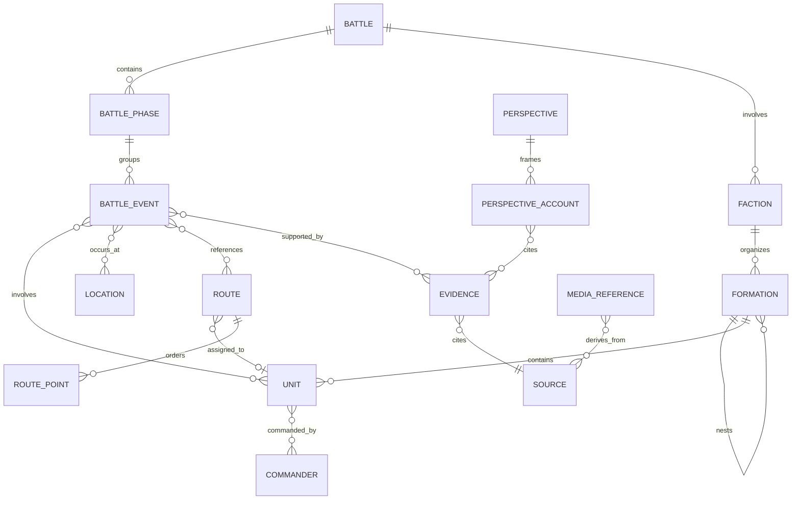

# Battlefield_OS — BR-1 Battle Domain Model

- 實作日期：2026-08-12
- Schema：`1.0.0`
- 狀態：BR-1 implementation baseline
- 依據：`BATTLE_REPLAY_ARCHITECTURE_AUDIT.md`
- 範圍：資料契約、驗證、legacy adapter、人工座標校正能力、古寧頭校準資料骨架
- 明確排除：BattleClock、Three.js／Cesium、部隊或路線動畫、CameraDirector、戰場特效、production UI 改版

本階段不把現有網站切換到新資料模型。`src/data/loader.ts` 與所有既有頁面繼續使用原本的 `data/*.json`；BR-1 模組只被資料驗證命令與測試載入，因此不增加現行瀏覽器 bundle，也不改變 production 頁面輸出。

## 1. Domain architecture

資料流固定為：

```text
Historical source catalog (existing data/sources.json)
  → LegacyBattlefieldAdapter
  → Canonical in-memory entities
  → Runtime validation and quality report
  → future Battle Replay controllers
```

Canonical domain 位於 `src/battle-replay/`，包含四個邊界：

1. `types/`：無框架、無 renderer、無戰役專屬常數的資料契約。
2. `validation/`：執行期 schema、地理、時間與參照完整性驗證。
3. `adapters/legacy/`：讀取既有 JSON，轉成 canonical in-memory model，不覆寫來源檔。
4. `services/coordinateOverride.ts`：development-time 人工座標覆核的純資料操作。

Schema 採 TypeScript contract 加 dependency-free runtime validator。Repository 原本沒有 Zod、Ajv 或其他同類 library；BR-1 不為單一資料管線再加入功能重疊依賴。測試使用 Node 內建 test runner。

## 2. Entity definitions

`Battle` 是 package 根節點，持有 slug、標題、時區、時間／地理範圍、phase、faction、source 與預設 perspective references。

`BattlePhase` 以穩定 ID、sequence 與 `HistoricalTime` 表達編輯／戰役階段；參與單位與事件只能使用 ID reference。

`Faction`、`Formation`、`Unit`、`Commander` 支援不完整的軍事層級。Formation level 包含 army、corps、division、regiment、battalion、company、platoon 等，也允許 ad-hoc 與 unknown。未知 parent、commander、strength 不需填假值。

`Location` 是 GeoJSON Feature，可保留 historical name、modern name、aliases、local/military/source names、search terms、座標來源與歷史／現代 geometry assertions。未知座標使用 `geometry: null`。

`Route` 是 LineString／MultiLineString GeoJSON Feature，不是 renderer line。它保存 route nature、route type、waypoints、時間模式、來源、geometry provenance 與 uncertainty segments。

`BattleEvent` 是 timeline、map、unit、route、evidence 與 perspective 的關聯橋梁。

`Evidence` 表達某個 Source 中支持或反駁 assertion 的局部證據；`Source` 表達出版品、檔案、網站、地圖或口述資料本身。

`Perspective` 保存 ROC、PLA、neutral editorial、disputed、unknown、research note 與 local oral account。Perspective account 仍須連接 evidence/source/confidence，不等同 factual truth。

`Uncertainty` 是可參照 entity，支援 time、location、route、identity、strength、casualty、interpretation 與 geometry dimensions。

`MediaReference` 可保存權利、credit、capture time 與影像 georeferencing metadata。

`CameraCue` 只有資料結構，保存觸發條件、focus reference、mode 與 auto/guided/manual behavior；本階段沒有 CameraDirector。

## 3. Relationship diagram



所有實體關係使用 ID；display name、翻譯文字與自由文字不能作 primary key。

## 4. Historical time model

`HistoricalTime.kind` 支援：

- `exact`
- `approximate`
- `range`
- `before`
- `after`
- `sequence-only`
- `unknown`

Precision 支援 `second`、`minute`、`hour`、`approximate-hour`、`time-range`、`sequence-only`、`unknown`。每個 time assertion 同時保存 timezone、source references、confidence 與 notes。

Exact/approximate 需要 `value`；range 需要 `earliest` 與 `latest`；before/after 使用單側邊界；sequence-only 只表達順序。像「凌晨」、「拂曉前」、「登陸後不久」不得被轉成虛構分鐘。

Validator 檢查 ISO 8601 可解析性、range 順序、kind/precision 一致、phase start/end 與可比較的 battle boundary。未知時間本身是合法資料狀態，不導致 validation fail。

## 5. Coordinate model

Canonical coordinate system 固定為 WGS84／`EPSG:4326`，座標順序固定為：

```text
[longitude, latitude, altitude?]
```

Longitude 合法範圍為 -180 到 180；latitude 為 -90 到 90；altitude 若存在必須是有限數值。BR-1 不設定 altitude datum 預設值。

Three.js XYZ、pixel、screen、任意 local coordinate 或 guessed scene position 都不是永久資料。未來 runtime pipeline 才可執行：

```text
WGS84 → local ENU → Three.js XYZ
```

轉換結果不得回寫 canonical historical data。

## 6. Coordinate provenance

`CoordinateProvenance` 保存：

- coordinate system、coordinate/final coordinate
- method、precision、verification status
- source references、confidence、notes
- original candidate、candidate source
- verifier、verification time、verification method

Verification status：`unverified`、`candidate`、`pending-manual-verification`、`manually-verified`、`source-verified`、`estimated`、`disputed`、`unknown`。

Coordinate method：official GIS、government map、field survey、survey、Google Maps/Earth manual reference、satellite manual identification、aerial/historical map georeference、local knowledge、manual correction、estimated、unknown。

Precision：exact、high、medium、approximate、area-only、unknown。

技術有效與歷史有效分開：合法經緯度只會通過 technical validation；沒有史料／人工覆核時仍輸出 historical warning。

## 7. Manual correction workflow

正式人工流程：

1. 匯入 historical location，保留原始名稱、aliases 與來源寫法。
2. 人工搜尋 modern candidate。
3. 以 Google Maps、Google Earth、政府 GIS、衛星／航照或 field knowledge 做視覺比對。
4. 記錄 candidate coordinate、candidate source 與 method。
5. Reviewer 人工確認後輸入 WGS84 longitude/latitude。
6. `applyManualCoordinateOverride()` 驗證數值，保存 original candidate 與完整 audit fields。
7. 狀態更新為 `manually-verified`，但 confidence 仍由史料審查決定。
8. Route waypoint 以相同方式逐點建立／移動／刪除。
9. 匯出 locations/routes GeoJSON。
10. 執行 `npm run validate:battle-data`。

人工確認優先於 AI-generated candidate；原始候選不會被無痕覆寫。

## 8. Google Maps / Earth reference policy

Google Maps／Earth 僅能作 development-time manual reference：搜尋現代地名、聚落、道路、營區、海岸、地貌，人工點選候選位置並與其他 GIS／影像比對。

禁止 scraping HTML、proprietary data 或 map tiles；禁止 bulk extraction、下載衛星 tiles 作永久 texture、建立未授權 imagery cache。Google 資料不成為 canonical database、production terrain 或 runtime dependency。

`MapReferenceAdapter` 只保留 vendor-neutral contract，provider 可為 Google manual reference、OpenStreetMap、government GIS、orthophoto、custom aerial 或 historical georeferenced map。Canonical domain 不 import vendor SDK。

## 9. Historical vs modern geometry

Location 可分別保存 `historicalGeometry` 與 `modernReferenceGeometry`，每個 assertion 都有獨立 `GeometryProvenance`。Provenance 保存 temporal context、valid from/to、來源、method、precision、verification status、estimated error 與 confidence。

因此：modern satellite imagery 不等於 1949 terrain；modern road/coastline/village extent 也不等於 1949 geometry。BR-1 只建立表達能力，不重建 1949 coastline 或 terrain。

## 10. Satellite / aerial georeferencing

`ImageryGeoreferencingMetadata` 可表達 CRS、bounds、control points、pixel size、rotation、source、capture date、accuracy、verification status 與 transform method。

沒有 georeference 的航照不得直接貼到 Three terrain 並宣稱精確。後續工作需先依資料條件選擇 control point calibration、affine、homography 或 GIS georeferencing，保存誤差與權利資訊，再供 runtime 使用。

現有 1944 航照仍維持未核准 georeference 狀態；BR-1 沒有改動影像或產生 terrain texture。

## 11. Ground Control Point strategy

每個 GCP 保存 stable ID、image pixel、WGS84 coordinate、source、confidence、verification status 與 notes。建議至少涵蓋不同分布與類型的固定特徵，例如道路交叉口、長期存在的建築／聚落、營區入口或可辨識海岸固定特徵。

GCP 選擇原則：

1. 不將移動、後期填築或時代不明特徵當作高可信控制點。
2. 控制點分布需覆蓋影像範圍，不能只集中單一角落。
3. 記錄影像年代與 reference geometry 年代差異。
4. 以 residual/error report 判定 transform 是否可接受。
5. Disputed GCP 不靜默刪除；保留狀態供 reviewer 比較。

## 12. Evidence model

Evidence 是 Source 中的局部 assertion，不複製整篇史料。它保存 source ID、evidence type、citation、page、excerpt reference、claim、related entity IDs、perspective、reliability 與 notes。

Validator 強制 `Evidence.sourceId` 指向現有 Source，並驗證 related entity references。未來 Event、Route、Location、Unit 的史實 claim 應透過 Evidence 追溯 Source。

## 13. Source model

既有 `data/sources.json` 是唯一 source catalog。BR-1 沒有建立 `data/battles/guningtou-1949/sources.json`；manifest 明確宣告 `legacy-battlefield-sources` adapter 與相對路徑。

Adapter 將既有 ID、title、author/institution、publication date、source type、URL/archive identifier、rights、access metadata 轉成 canonical Source。Legacy 原檔與 production consumer 不變。

## 14. Perspective model

支援 ROC、PLA、Neutral Editorial、Disputed、Unknown，以及 research note 與 local oral account。Package 中的五個基本 perspective record 只是 vocabulary，不包含未經來源支持的 claims。

同一 Event 可連接多個 perspective accounts。每個 account 各自保存 text、evidence、source 與 confidence；neutral editorial 只能綜整差異，不能取代其他說法或偽裝成唯一真相。

## 15. GeoJSON convention

GeoJSON 採 RFC 7946 合理子集：Point、LineString、Polygon，並支援必要的 MultiPoint、MultiLineString、MultiPolygon。Feature geometry 可為 `null` 以明確表示未定位 entity。

Locations、routes、battle areas 分檔；所有 coordinate 使用 longitude-first WGS84。Validator 檢查 geometry type、position range、LineString 最少點數、Polygon ring 最少四點與封閉性。

只有起點／終點的 legacy topology 不會自動產生 LineString。空 `routes.geojson` 比一條看似可信的假直線更正確。

## 16. Stable ID convention

ID 採大寫類型 prefix、戰役 scope 與不具語意的序號：

```text
BAT-GUN-1949
PHA-GUN-0001
LOC-GUN-0001
RTE-GUN-0001
RPT-GUN-0001
EVT-GUN-0001
EVD-GUN-0001
```

既有 legacy IDs（如 `POI-0006`、`SRC-0001`）由 adapter 保留。Canonical ID 不由中文名稱、英文翻譯或 UI slug 動態產生；改名不改 ID。新的 ID 一旦被引用就不得回收給不同 entity。

## 17. Schema versioning

目前 schemaVersion 固定為 `1.0.0`，manifest 與所有 canonical entity 都需帶版本。Validator 遇到不支援版本會輸出 ERROR。

未來 v2 必須提供顯式 migration：讀入舊資料、產生新 in-memory representation、驗證、比較 golden fixture，完成後才可選擇寫回。V1 reader 在 migration 經測試並有淘汰期以前保留；禁止用通用 fallback 猜測欄位來掩蓋 schema drift。

## 18. Validation rules

`npm run validate:battle-data` 先以獨立 TypeScript config 編譯 BR-1 tools，再執行：

- schemaVersion、required structures、enums
- ID uniqueness 與 stable reference integrity
- event → unit/location/route/evidence/perspective
- route → unit/phase/location/event/source
- evidence → source/entity/perspective
- WGS84 coordinate shape/range
- GeoJSON geometry 與 polygon closure
- coordinate provenance 與 manual audit fields
- HistoricalTime kind/precision/format/range
- phase/battle temporal boundaries
- route waypoint order
- unresolved entity、unverified coordinate、route status
- 22 個 legacy JSON parse 與 adapter inventory

診斷分為 ERROR、WARNING、INFO，並標示 technical、historical、integrity 或 schema domain。ERROR 使 command 失敗；歷史不確定通常是 WARNING。Quality status 為 Verified、Needs Review、Incomplete、Conflicted 或 Invalid。

目前 BR-1 package 預期結果是 `Incomplete`：零 error、六個未定位地點產生 historical warnings。這是資料誠實性，不是測試失敗。

## 19. Legacy adapter strategy

`LegacyBattlefieldAdapter` 採 adapter-first migration：

- Existing Source → canonical Source，不複製 source database。
- Existing POI → candidate Location；legacy coordinate 保留為 candidate，統一降為 pending manual verification。
- Existing Unit → canonical Unit；無 source 的 identity 保持 unknown confidence。
- Existing Event/Timeline-style record → canonical Event；free-text unit/location 保留 metadata，不猜 stable references。
- Existing route database → `TopologicalConnection`；36 條 connection 中 0 條被提升為 historical Route。

Adapter 回傳 issues 與 unresolved references，可在 build/test 顯示。它不寫回 legacy JSON，也沒有接入 production loader。

## 20. Coordinate Editor architecture

BR-1 只預留 development-only architecture，沒有建立 UI。Editor state 可保存 location ID、candidate、manual coordinate、route waypoints 與 dirty state；reference provider 透過 `MapReferenceAdapter`；儲存時只能輸出 WGS84 GeoJSON。

後續 Editor 可以實作 historical/modern names、aliases、candidate list、drag marker、POI CRUD、route waypoint CRUD、confidence、verification、source、notes、preview 與 export。刪除需有引用檢查與可恢復流程；production runtime 不包含 vendor credentials 或編輯能力。

## 21. Guningtou package structure

```text
data/battles/guningtou-1949/
├─ manifest.json
├─ battle.json
├─ phases.json
├─ factions.json
├─ formations.json
├─ units.json
├─ commanders.json
├─ locations.geojson
├─ routes.geojson
├─ battle-areas.geojson
├─ events.json
├─ evidence.json
├─ perspectives.json
├─ uncertainties.json
├─ media.json
└─ camera-cues.json
```

這是 `calibration-overlay`，不是新的 production Battlefield Database。它只保存 BR-1 明確要求的校準地點與 controlled vocabulary；source catalog 仍透過 adapter 指向既有資料。

六個 Location：嚨口登陸區、嚨口海岸、安岐、安東二營區、南山、北山。全部 `geometry: null`、`pending-manual-verification`、confidence unknown。南山／北山只保留 legacy candidate refs，不複製其未核准座標。

## 22. Known unresolved data

目前 unresolved：

- Locations：六個 calibration targets 全部待 historical identity 與 coordinate review。
- Coordinates：六個全部無 canonical coordinate。
- Routes：零 canonical route；legacy 36 筆僅為 topology。
- Units：package 中零 unit；legacy adapter 可讀 25 筆，但 identity/source/hierarchy 尚待逐筆 evidence linkage。
- Commanders／strength／casualties：未建立未經核准資料。
- Events：package 中零 event；legacy event 的 free-text unit/location 未猜成 references。
- Time：phase 只用 sequence-only editorial boundary；沒有 minute-level replay timestamp。
- Geometry：沒有核准 historical route、battle area、1949 coastline 或 georeferenced aerial overlay。
- Imagery：現有 1944 航照尚無本契約要求的 GCP/error/verification metadata。

## 23. BR-2 readiness

BR-1 已提供 WGS84/GeoJSON contract、geometry provenance、manual override、GCP/georeference metadata、diagnostics 與校準 queue 所需 entity。進入 BR-2 前仍需：

1. 歷史／地理 reviewer 確認六個 Location identity、aliases 與 candidate mapping。
2. 至少核准 local ENU origin，附 source/provenance。
3. 完成可接受的 coordinate review procedure 與 reviewer identity policy。
4. 對任何將顯示的 route 逐點建立 geometry、source、uncertainty 與 verification；不得從 topology 拉直線。
5. 若使用 1944 航照，完成 rights、GCP、transform 與 residual error report。
6. 定義 altitude reference 與 terrain/modern/historical layer 標示。
7. 先通過 `npm run validate:battle-data` 與所有 automated tests。

目前判定：BR-1 完成後可供 architecture review；BR-2 為 Conditional Go，取決於上述人工地理核准。Route／troop animation 維持 No-Go。

## BR-1 acceptance gate

- [x] Canonical domain model、runtime validation、stable IDs、schema versioning
- [x] WGS84、GeoJSON、HistoricalTime、coordinate/geometry provenance
- [x] Manual override、historical/modern names、aliases、vendor-neutral map reference
- [x] Route waypoints、partial uncertainty、historical/modern geometry separation
- [x] Imagery georeference metadata 與 GCP strategy
- [x] Evidence/Source separation、Perspective、Uncertainty、Unit hierarchy
- [x] Event↔Unit、Route↔Unit、Evidence↔Source integrity validation
- [x] Legacy adapter、Coordinate Editor architecture、Guningtou package skeleton
- [x] Unverified coordinates are warnings; no fabricated coordinates/routes/times/units
- [x] Automated tests and repeatable validation command
- [x] Production consumer remains unchanged
